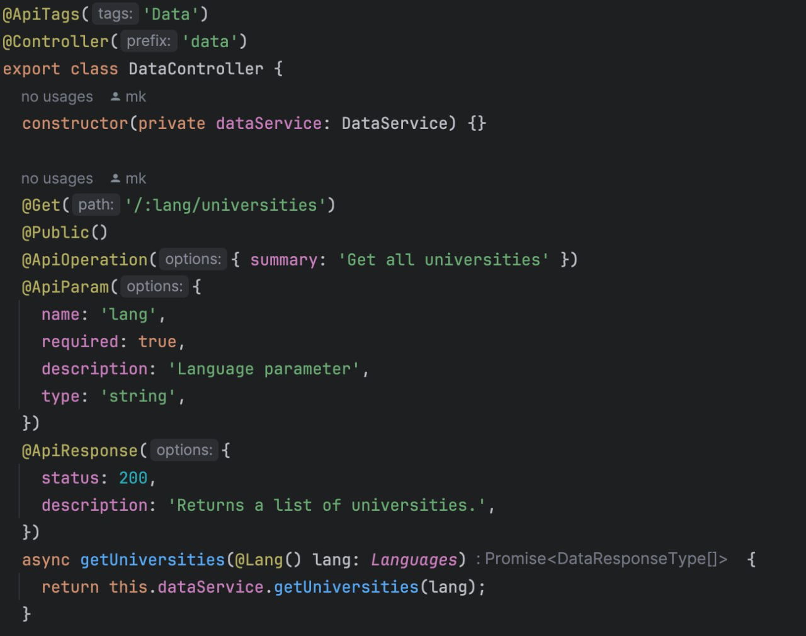
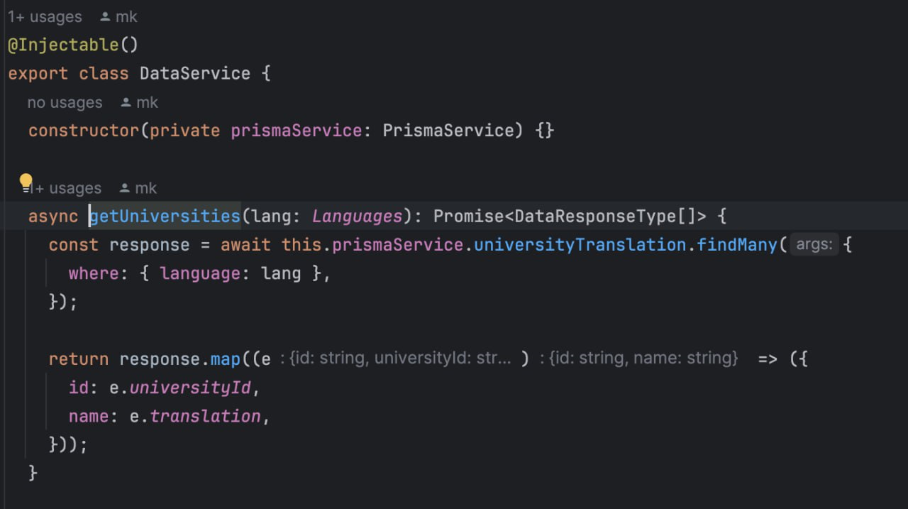

## Проект на Node.js
___
### Працював у команді з тімлідом над проектом на платформі Node.js. Створював прості ендпоїнти для REST API.

### Для прикладу хочу показати на базі данних Postgree SQL, налаштованих через призму:


### - Усі рядки які починаються на "@"називаються декораторами, які служать для додавання логіки класу, функції чи змінні.

### Почнемо з ```ApiTags```: він дозволяє писати документацію по бекенду прям у коді.
### ```Controller```: вказуємо загальну точку входу для всіх ендпоїнтів, які йому належать.
### ```Get```: тип запиту Get, такі як Put, Post, Delete.
### ```Public```: створений тімлідом декоратор, який допомагає зрозуміти серверу про неавторизованих юзерів.
### ```ApiOperation```: свагер декоратор, який описує ендпоїнт.
### ```ApiParam```: свагер декоратор, який параметер приймає запит та також описує його.
### ```Lang```: сворений тімлідом декоратор, для отримання валідації мови(дозволено тільки uk(ukrainian), en(english), pl(polish)).

---
###  Функці ```async``` тобто асинхронна, дозволяючи працбвати з базами данних.
### Приймаємо тип ```Lang``` із допустимих мов.
### Далі переносимо бізнес логіку в сервіс, результак функції якої повертаємо в наш контролер.

### ```Injectable```: це декоратор, який допомагає використовувати данний сервіс.
### Далі оголошуємо конструктор, який допомагає використовувати базу данних, побудованну на призмі.
### Далі прописали функцію, яка допомагає використовувати базу даних та викликали з контролера.
### Конструктор: constructor(private prismaService: PrismaService) визначає ін'єкцію залежності. PrismaService є сервісом, який використовується для взаємодії з базою даних через Prisma - сучасний ORM (Object-Relational Mapping) інструмент. private у цьому контексті означає, що prismaService доступний тільки всередині цього класу.

### Метод getUniversities(lang: Languages): Promise<DataResponseType[]>: Це асинхронний метод, який приймає параметр lang типу Languages (це перелік підтримуваних мов). Метод повертає обіцянку (Promise), яка резолвиться в масив об'єктів типу DataResponseType.

### Запит до БД за допомогою Prisma: Всередині методу виконується асинхронний запит до бази даних через prismaService. Використовується метод findMany для отримання даних з таблиці universityTranslation, де поле language відповідає переданому параметру lang. Це означає, що вибираються всі записи, де мова відповідає запитаній.

### Формування відповіді: Отримані з бази даних записи трансформуються за допомогою методу map. Кожен елемент масиву response перетворюється в об'єкт з полями id та name, де id відповідає universityId з запису, а name - полю translation.

### Таким чином, цей сервіс надає функціональність для отримання інформації про університети, з урахуванням обраної мови, і використовує Prisma для взаємодії з базою даних. Результатом роботи цього методу є масив об'єктів, які містять ідентифікатор і назву університету, перекладену на запитану мову.
___